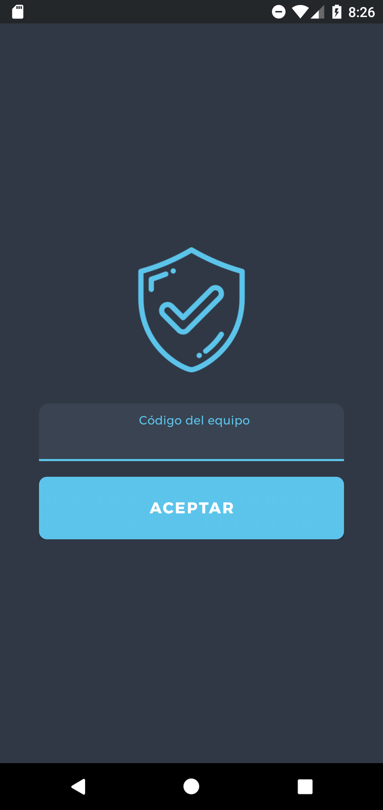

# Goality | Team Manager
Proyecto Fin de Ciclo 2021 @ UEM desarrollado por:

- Santiago Torres  
- Nacho Jimenez  
- Sean Leitch  

## ¿Qué es Goality?
Goality es una aplicación de gestión de jugadores y equipos de fútbol. Permite que los usuarios se den de alta como miembros del equipo técnico, ver los resultados de su equipo, convocar entrenamientos, manejar los perfiles de los miembros además de visualizar las estadísticas de los jugadores y su equipo. Ayudará a los clubes a tener centralizados y accesibles todos los datos y estadísticas de sus jugadores. 
Para el desarrollo de este proyecto hemos contactado con el equipo Atlético Chopera Alcobendas 04,.

## GALERÍA
### Inicio
| Splash | Login | Seguridad | Signup | Signup |
|:-:|:-:|:-:|:-:|-|
|  |  |  |  |  | 

### Mis Partidos y entrenamientos
| Partidos | P. Detalle | Agregar Resultado | Entrenamientos | Ent. Detalle |
|:-:|:-:|:-:|:-:|:-:|
|  |  |  |  |  |

### Perfiles de los miembros del equipo y rendimiento
| Lista Equipo | Detalle | Editar | Rendimiento 1 | Rendimiento 2 |
|:-:|:-:|:-:|:-:|:-:|
|  |  |  |  |  |

### Perfiles de los miembros del equipo y rendimiento
| Bottom menu | Nav. Drawer | Edit Pass | Información |
|:-:|:-:|:-:|:-:|
|  |  |  |  |

### Previsuzalización de la aplicación
| Bottom menu |
|:-:|
|  |
